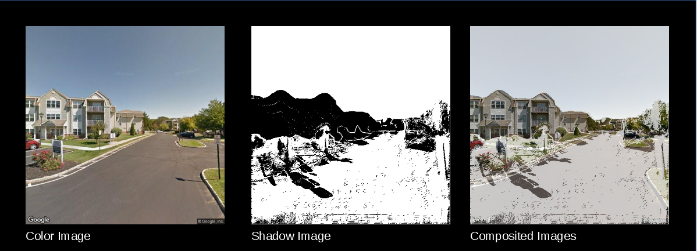
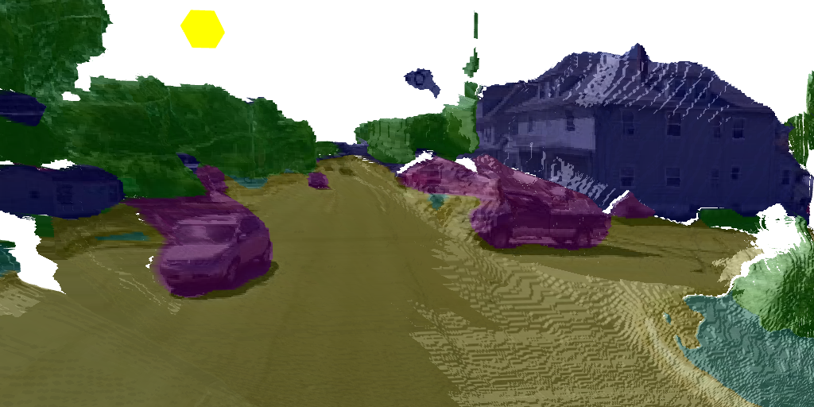

# ShadowView

Takes for a given position six images (one for each side), which are augmented with depth and segmentation data. The "ShadowView" tool projects them into 3D space and calculates the shadows based on the sun position.

# Use

Open the index.html file with the browser of your choice. (developed on firefox)

Load the images through the interface. (examples located in ./data)

You can adjust the suns position through sliders. The TDT (Triangle Distortion Threshold) and DDT (Depth Difference Threshold) let you
adjust the amount of distorted triangle to be considered.

Through the export button, the baked textures can be saved for later use.

Enjoy! :D

# Additional Information

- THREE.js library (https://threejs.org/) is used

- Depth images were estimated based on the color images by "monodepth" (https://github.com/mrharicot/monodepth)

